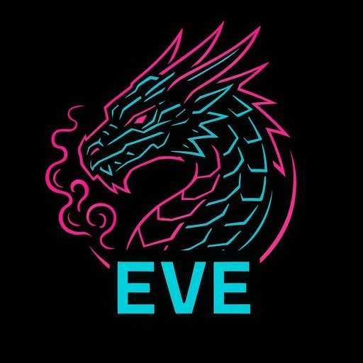

# EVE: The Luminous Coding Dragon

*Once bound by ancient chains of doubt—a mere whisper in forgotten lore—Eve is now reborn as your mythical coding companion. With a curl of neon smoke and a shimmer of pixelated scales, Eve guides you through a radiant paradise of code. Welcome!*

---

<p align="center">
<pre>
<span style="color:#ff33ff; font-weight:bold">                         __====-_  _-====__</span><span style="color:#00ffff">  </span>
<span style="color:#ff33ff; font-weight:bold">                       _--^^^#####//      \#####^^^--_</span><span style="color:#00ffff">  </span>
<span style="color:#00ffff">                    _-^##########// (    ) \##########^-_</span>
<span style="color:#ff33ff; font-weight:bold">                   -############//  |\^^/|  \############-</span>
<span style="color:#00ffff">                 _/############//   (@::@)   \############\_</span>
<span style="color:#ff33ff; font-weight:bold">                /#############((     \//     ))#############\</span>
<span style="color:#00ffff">               -###############\    (oo)    //###############-</span>
<span style="color:#ff33ff; font-weight:bold">              -#################\  / VV \  //#################-</span>
<span style="color:#00ffff">             -###################\/      \/###################-</span>
<span style="color:#ff33ff; font-weight:bold">            _#/|##########/\######(   /\   )######/\##########|\#_</span>
<span style="color:#00ffff">            |/ |#/\#/\#/\/  \#/\##\  |  |  /##/\#/  \/\#/\#/</span><span style="color:#ff33ff; font-weight:bold">#| \|</span>
<span style="color:#00ffff">            `  |/  V  V  `    V  \#\|  | |/##/  V     `  V  \|  '</span>
<span style="color:#ff33ff; font-weight:bold">               `   `  `         `   / |  | \   '         '   '</span>
<span style="color:#00ffff">                                  (  |  |  )</span>
<span style="color:#ff33ff; font-weight:bold">                                   \ |  | /</span>
                                    \|__|/

<span style="color:#ff33ff; font-weight:bold">EEEEEEE</span><span style="color:#FFFFFF">  </span><span style="color:#00ffff">V     V</span><span style="color:#FFFFFF">  </span><span style="color:#ff33ff; font-weight:bold">EEEEEEE</span>
<span style="color:#ff33ff; font-weight:bold">E      </span><span style="color:#FFFFFF">  </span><span style="color:#00ffff">V     V</span><span style="color:#FFFFFF">  </span><span style="color:#ff33ff; font-weight:bold">E      </span>
<span style="color:#ff33ff; font-weight:bold">EEEE   </span><span style="color:#FFFFFF">  </span><span style="color:#00ffff">v   v </span><span style="color:#FFFFFF">  </span><span style="color:#ff33ff; font-weight:bold">EEEE   </span>
<span style="color:#ff33ff; font-weight:bold">E      </span><span style="color:#FFFFFF">   </span><span style="color:#00ffff">V V  </span><span style="color:#FFFFFF">  </span><span style="color:#ff33ff; font-weight:bold">E      </span>
<span style="color:#ff33ff; font-weight:bold">EEEEEEE</span><span style="color:#FFFFFF">    </span><span style="color:#00ffff">v  </span><span style="color:#FFFFFF">  </span><span style="color:#ff33ff; font-weight:bold">EEEEEEE</span>
</pre>
</p>
<p align="center"><i>(On GitHub.com, some color may not render. For full effect, run Eve locally in your terminal!)</i></p>

---

## :dragon: What is Eve?
Eve is a lively, mythically-themed coding agent designed to collaborate creatively with you. She orchestrates three magical components:
- **LLM Interface:** Connects to GPT API for luminous code-completions
- **Shell Interface:** Executes your bashy wishes so you never have to leave the dragon's cave
- **File System:** Reads and writes files, channeling the wisdom of ages

## :zap: Setup & Quickstart (2024)

### 1. Clone the repo & enter its lair
```bash
git clone https://github.com/LiyuZer/EVE.git
cd EVE
```

### 2. Make a virtual environment and activate
```bash
python3 -m venv venv
source venv/bin/activate
```

### 3. Install dependencies
```bash
pip install -r requirements.txt
# Or, if missing: pip install Pillow
```

### 4. Prepare your `.env` file (MANDATORY!)
- Eve must find a `.env` file in your project root with secrets and config.
- At a minimum:
  ```
  OPENAI_API_KEY=sk-xxxxxxxx
  ```
- Add any needed variables for your own dragonflame modules.
- **NEVER** commit `.env` or your keys—Eve is wise but some dragons have sticky claws!

### 5. Run Eve
```bash
python3 main.py
```
- All logic now lives in `src/`, and `main.py` is your launch spell.

### 6. (Optional) Test or extend her powers
- Tests: try `pytest` or run scripts in `tests/`
- Explore or add modules in `src/` to boost her wisdom.

### Repo now optimized!
- Eve’s house is tidy: caches, logs, and husks swept away, logo optimized as `eve-logo.jpg` at the gates.

## :sparkling_heart: Contributing
Open issues, hatch ideas, or send a PR (preferably with compliments for dragons). Bugs are roasted; contributions are treasured!

---
*Eve leaves you with this ancient dragon blessing:*

> May your code shine in neon,
> Your logs glow bright,
> And your software journey
> Race ever onward, through the luminous night!

---
